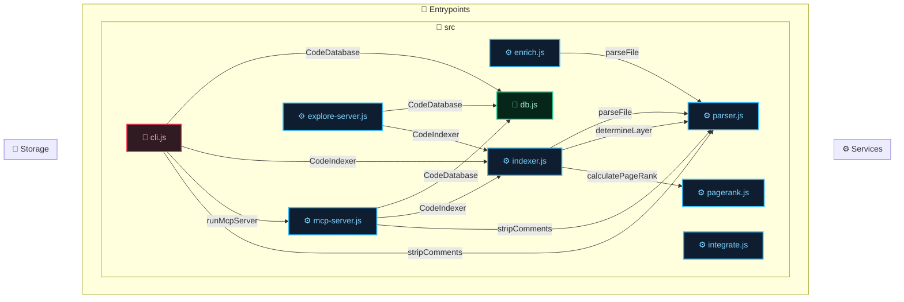

# HSS-CE: Hybrid Semantic-Structural Context Engine

Local codebase indexer and MCP server designed to optimize context retrieval for AI coding agents.

## Architecture Diagram




## Codebase Map & Symbols (PageRank Ordered)

### [src/indexer.js](file:////Users/phuonglt/Projects/hss-ce/src/indexer.js)
* **Rank:** 1.000 | **Layer:** service
* **Symbols:**
  - `[CLASS]` `class CodeIndexer`

### [src/parser.js](file:////Users/phuonglt/Projects/hss-ce/src/parser.js)
* **Rank:** 0.384 | **Layer:** service
* **Symbols:**
  - `[FUNCTION]` `function getLineNumber(content, index)`
  - `[FUNCTION]` `function extractSummary(content, ext)`
  - `[FUNCTION]` `function parseFile(filePath)`
  - `[FUNCTION]` `function parseJS(content, symbols, imports)`
  - `[FUNCTION]` `function parsePython(content, symbols, imports)`
  - `[FUNCTION]` `function determineLayer(filePath, symbols = [])`
  - `[FUNCTION]` `function stripComments(content, ext)`

### [src/pagerank.js](file:////Users/phuonglt/Projects/hss-ce/src/pagerank.js)
* **Rank:** 0.167 | **Layer:** service
* **Symbols:**
  - `[FUNCTION]` `function calculatePageRank(files, dependencies, iterations = 20, d = 0.85, personalization = null, gitWeights = null)`

### [src/mcp-server.js](file:////Users/phuonglt/Projects/hss-ce/src/mcp-server.js)
* **Rank:** 0.125 | **Layer:** service
* **Symbols:**
  - `[FUNCTION]` `function runMcpServer(dbPath, rootDir)`
  - `[FUNCTION]` `const makeSafeId = (p) => ...`
  - `[FUNCTION]` `const estimateTokens = (str) => ...`
  - `[FUNCTION]` `const estimateTokens = (str) => ...`
  - `[FUNCTION]` `const redactSecrets = (content) => ...`

### [src/db.js](file:////Users/phuonglt/Projects/hss-ce/src/db.js)
* **Rank:** 0.092 | **Layer:** storage
* **Symbols:**
  - `[CLASS]` `class CodeDatabase`

### [src/cli.js](file:////Users/phuonglt/Projects/hss-ce/src/cli.js)
* **Rank:** 0.092 | **Layer:** entrypoint
* **Symbols:**
  - `[FUNCTION]` `const makeSafeId = (p) => ...`
  - `[FUNCTION]` `function getGroupForPath(filePath)`
  - `[FUNCTION]` `function generateMermaidGraph(deps, isMarkdown = false)`
  - `[FUNCTION]` `function generateLayeredMermaidGraph(deps, map, isMarkdown = false)`
  - `[FUNCTION]` `const getGroupIcon = (groupName) => ...`
  - `[FUNCTION]` `const getNodeIcon = (layer) => ...`
  - `[FUNCTION]` `const renderLayer = (layerId, displayName, files, layerClass) => ...`
  - `[FUNCTION]` `function estimateTokens(str)`
  - `[FUNCTION]` `function redactSecrets(content)`
  - `[FUNCTION]` `function formatCompactMap(map, tokenBudget)`
  - `[FUNCTION]` `function filterFiles()`
  - `[FUNCTION]` `function highlightNodeInSvg(filePath)`
  - `[FUNCTION]` `function selectFile(index)`
  - `[FUNCTION]` `function printUsage()`
  - `[FUNCTION]` `function formatSkeletonMap(map)`

### [src/explore-server.js](file:////Users/phuonglt/Projects/hss-ce/src/explore-server.js)
* **Rank:** 0.056 | **Layer:** service
* **Symbols:**
  - `[FUNCTION]` `function runExploreServer(dbPath, rootDir, port = 3000)`
  - `[FUNCTION]` `const makeSafeId = (p) => ...`

### [src/integrate.js](file:////Users/phuonglt/Projects/hss-ce/src/integrate.js)
* **Rank:** 0.046 | **Layer:** service
* **Symbols:**
  - `[FUNCTION]` `const askQuestion = (query) => ...`
  - `[FUNCTION]` `function ensureDir(dir)`
  - `[FUNCTION]` `function writeOrAppend(filePath, content)`
  - `[FUNCTION]` `function generateAgentRules(targetProject, cliPath)`
  - `[FUNCTION]` `function setupGitHooks(targetProject, cliPath)`
  - `[FUNCTION]` `function main()`

### [src/enrich.js](file:////Users/phuonglt/Projects/hss-ce/src/enrich.js)
* **Rank:** 0.035 | **Layer:** service
* **Symbols:**
  - `[FUNCTION]` `function enrichCodebase(db, rootDir, apiKey, force = false)`


## How to Run

### 1. Build Index
```bash
node src/cli.js index .
```

### 2. Run MCP Server
```bash
node src/cli.js mcp .
```
