# HSS-CE: Hybrid Semantic-Structural Context Engine

Local codebase indexer and MCP server designed to optimize context retrieval for AI coding agents.

## Architecture Diagram

```mermaid
graph TD
  classDef entrypoint fill:#311b22,stroke:#f43f5e,stroke-width:2px,color:#fda4af;
  classDef service fill:#0f1d30,stroke:#38bdf8,stroke-width:2px,color:#7dd3fc;
  classDef storage fill:#06261a,stroke:#34d399,stroke-width:2px,color:#a7f3d0;

  subgraph Entrypoints["🚀 Entrypoints"]
    subgraph src["📂 src"]
      src_cli_js["🚀 cli.js"]
    end
  end
  class src_cli_js entrypoint;

  subgraph Services["⚙️ Services"]
    subgraph src["📂 src"]
      src_mcp_server_js["⚙️ mcp-server.js"]
      src_parser_js["⚙️ parser.js"]
      src_indexer_js["⚙️ indexer.js"]
      src_pagerank_js["⚙️ pagerank.js"]
      src_explore_server_js["⚙️ explore-server.js"]
      src_integrate_js["⚙️ integrate.js"]
      src_enrich_js["⚙️ enrich.js"]
      src_explore_html["⚙️ explore.html"]
    end
    subgraph tests["📂 tests"]
      tests_dependency_path_test_js["⚙️ dependency_path.test.js"]
      tests_pack_test_js["⚙️ pack.test.js"]
      tests_fts_test_js["⚙️ fts.test.js"]
    end
    subgraph Root["📂 Root"]
      architecture_html["⚙️ architecture.html"]
      install_sh["⚙️ install.sh"]
    end
  end
  class src_mcp_server_js service;
  class src_parser_js service;
  class src_indexer_js service;
  class tests_dependency_path_test_js service;
  class tests_pack_test_js service;
  class src_pagerank_js service;
  class src_explore_server_js service;
  class tests_fts_test_js service;
  class src_integrate_js service;
  class architecture_html service;
  class src_enrich_js service;
  class install_sh service;
  class src_explore_html service;

  subgraph Storage["💾 Storage"]
    subgraph src["📂 src"]
      src_db_js["💾 db.js"]
    end
  end
  class src_db_js storage;

  src_enrich_js -->|"parseFile"| src_parser_js
  src_explore_server_js -->|"CodeDatabase"| src_db_js
  src_explore_server_js -->|"CodeIndexer"| src_indexer_js
  tests_fts_test_js -->|"CodeDatabase"| src_db_js
  tests_fts_test_js -->|"CodeIndexer"| src_indexer_js
  src_cli_js -->|"CodeDatabase"| src_db_js
  src_cli_js -->|"CodeIndexer"| src_indexer_js
  src_cli_js -->|"runMcpServer"| src_mcp_server_js
  src_cli_js -->|"stripComments"| src_parser_js
  src_cli_js -->|"generateSkeletonContent"| src_parser_js
  src_indexer_js -->|"parseFile"| src_parser_js
  src_indexer_js -->|"determineLayer"| src_parser_js
  src_indexer_js -->|"calculatePageRank"| src_pagerank_js
  src_mcp_server_js -->|"CodeDatabase"| src_db_js
  src_mcp_server_js -->|"CodeIndexer"| src_indexer_js
  src_mcp_server_js -->|"stripComments"| src_parser_js
  src_mcp_server_js -->|"generateSkeletonContent"| src_parser_js
  tests_dependency_path_test_js -->|"CodeDatabase"| src_db_js
  tests_dependency_path_test_js -->|"CodeIndexer"| src_indexer_js
  tests_pack_test_js -->|"CodeDatabase"| src_db_js
  tests_pack_test_js -->|"CodeIndexer"| src_indexer_js
  tests_pack_test_js -->|"determineLayer"| src_parser_js
  tests_pack_test_js -->|"generateSkeletonContent"| src_parser_js
```




## Codebase Map & Symbols (PageRank Ordered)

### [src/db.js](file:////Users/phuonglt/Projects/hss-ce/src/db.js)
* **Rank:** 1.000 | **Layer:** storage
* **Symbols:**
  - `[CLASS]` `class CodeDatabase`

### [src/mcp-server.js](file:////Users/phuonglt/Projects/hss-ce/src/mcp-server.js)
* **Rank:** 0.481 | **Layer:** service
* **Symbols:**
  - `[FUNCTION]` `function runMcpServer(dbPath, rootDir)`
  - `[FUNCTION]` `const makeSafeId = (p) => ...`
  - `[FUNCTION]` `const estimateTokens = (str) => ...`
  - `[FUNCTION]` `const estimateTokens = (str) => ...`
  - `[FUNCTION]` `const redactSecrets = (content) => ...`
  - `[FUNCTION]` `const generateBlock = (fileContent, skeletonMode) => ...`
  - `[FUNCTION]` `const getRelativePath = (p) => ...`

### [src/parser.js](file:////Users/phuonglt/Projects/hss-ce/src/parser.js)
* **Rank:** 0.405 | **Layer:** service
* **Symbols:**
  - `[FUNCTION]` `function getLineNumber(content, index)`
  - `[FUNCTION]` `function extractSummary(content, ext)`
  - `[FUNCTION]` `function parseFile(filePath)`
  - `[FUNCTION]` `function parseJS(content, symbols, imports)`
  - `[FUNCTION]` `function parsePython(content, symbols, imports)`
  - `[FUNCTION]` `function determineLayer(filePath, symbols = [])`
  - `[FUNCTION]` `function stripComments(content, ext)`
  - `[FUNCTION]` `function generateSkeletonContent(content, ext, symbols = [], summary = null)`
  - `[CLASS]` `class body`
  - `[INTERFACE]` `interface body`

### [src/cli.js](file:////Users/phuonglt/Projects/hss-ce/src/cli.js)
* **Rank:** 0.369 | **Layer:** entrypoint
* **Symbols:**
  - `[FUNCTION]` `const makeSafeId = (p) => ...`
  - `[FUNCTION]` `function getGroupForPath(filePath)`
  - `[FUNCTION]` `function generateMermaidGraph(deps, isMarkdown = false)`
  - `[FUNCTION]` `function generateLayeredMermaidGraph(deps, map, isMarkdown = false)`
  - `[FUNCTION]` `const getGroupIcon = (groupName) => ...`
  - `[FUNCTION]` `const getNodeIcon = (layer) => ...`
  - `[FUNCTION]` `const renderLayer = (layerId, displayName, files, layerClass) => ...`
  - `[FUNCTION]` `function estimateTokens(str)`
  - `[FUNCTION]` `function redactSecrets(content)`
  - `[FUNCTION]` `function formatCompactMap(map, tokenBudget)`
  - `[FUNCTION]` `const getRelativePath = (p) => ...`
  - `[FUNCTION]` `function filterFiles()`
  - `[FUNCTION]` `function highlightNodeInSvg(filePath)`
  - `[FUNCTION]` `function selectFile(index)`
  - `[FUNCTION]` `const generateBlock = (fileContent, skeletonMode) => ...`
  - `[FUNCTION]` `function printUsage()`
  - `[FUNCTION]` `function formatSkeletonMap(map)`

### [src/indexer.js](file:////Users/phuonglt/Projects/hss-ce/src/indexer.js)
* **Rank:** 0.315 | **Layer:** service
* **Symbols:**
  - `[CLASS]` `class CodeIndexer`

### [package.json](file:////Users/phuonglt/Projects/hss-ce/package.json)
* **Rank:** 0.312 | **Layer:** config
* No exported symbols.

### [tests/dependency_path.test.js](file:////Users/phuonglt/Projects/hss-ce/tests/dependency_path.test.js)
* **Rank:** 0.112 | **Layer:** service
* **Symbols:**
  - `[FUNCTION]` `function funA()`
  - `[FUNCTION]` `function funB()`
  - `[FUNCTION]` `function funC()`

### [tests/pack.test.js](file:////Users/phuonglt/Projects/hss-ce/tests/pack.test.js)
* **Rank:** 0.047 | **Layer:** service
* **Symbols:**
  - `[FUNCTION]` `function testFunc(a, b)`
  - `[CLASS]` `class Calculator`
  - `[FUNCTION]` `function testFunc(a, b)`
  - `[CLASS]` `class Calculator`
  - `[FUNCTION]` `function testFunc(a, b)`
  - `[CLASS]` `class Calculator`
  - `[CLASS]` `class body`
  - `[CLASS]` `class MyClass`
  - `[CLASS]` `class MyClass`
  - `[CLASS]` `class MyClass`
  - `[CLASS]` `class body`
  - `[FUNCTION]` `function foo()`
  - `[FUNCTION]` `function foo()`
  - `[FUNCTION]` `const estimateTokens = (str) => ...`
  - `[FUNCTION]` `const generateBlock = (fileContent, skeletonMode) => ...`
  - `[FUNCTION]` `function foo()`

### [README.md](file:////Users/phuonglt/Projects/hss-ce/README.md)
* **Rank:** 0.041 | **Layer:** documentation
* No exported symbols.

### [src/pagerank.js](file:////Users/phuonglt/Projects/hss-ce/src/pagerank.js)
* **Rank:** 0.038 | **Layer:** service
* **Symbols:**
  - `[FUNCTION]` `function calculatePageRank(files, dependencies, iterations = 20, d = 0.85, personalization = null, gitWeights = null)`

### [src/explore-server.js](file:////Users/phuonglt/Projects/hss-ce/src/explore-server.js)
* **Rank:** 0.038 | **Layer:** service
* **Symbols:**
  - `[FUNCTION]` `function runExploreServer(dbPath, rootDir, port = 3000)`
  - `[FUNCTION]` `const makeSafeId = (p) => ...`

### [tests/fts.test.js](file:////Users/phuonglt/Projects/hss-ce/tests/fts.test.js)
* **Rank:** 0.038 | **Layer:** service
* **Symbols:**
  - `[FUNCTION]` `function calculateTotal(price, tax)`
  - `[FUNCTION]` `function analyzeCodebase()`

### [src/integrate.js](file:////Users/phuonglt/Projects/hss-ce/src/integrate.js)
* **Rank:** 0.033 | **Layer:** service
* **Symbols:**
  - `[FUNCTION]` `const askQuestion = (query) => ...`
  - `[FUNCTION]` `function ensureDir(dir)`
  - `[FUNCTION]` `function writeOrAppend(filePath, content)`
  - `[FUNCTION]` `function generateAgentRules(targetProject, cliPath)`
  - `[FUNCTION]` `function setupGitHooks(targetProject, cliPath)`
  - `[FUNCTION]` `function main()`

### [architecture.html](file:////Users/phuonglt/Projects/hss-ce/architecture.html)
* **Rank:** 0.027 | **Layer:** service
* No exported symbols.

### [src/enrich.js](file:////Users/phuonglt/Projects/hss-ce/src/enrich.js)
* **Rank:** 0.023 | **Layer:** service
* **Symbols:**
  - `[FUNCTION]` `function enrichCodebase(db, rootDir, apiKey, force = false)`

### [CODEBASE.md](file:////Users/phuonglt/Projects/hss-ce/CODEBASE.md)
* **Rank:** 0.023 | **Layer:** documentation
* No exported symbols.

### [install.sh](file:////Users/phuonglt/Projects/hss-ce/install.sh)
* **Rank:** 0.023 | **Layer:** service
* No exported symbols.

### [package-lock.json](file:////Users/phuonglt/Projects/hss-ce/package-lock.json)
* **Rank:** 0.019 | **Layer:** config
* No exported symbols.

### [src/explore.html](file:////Users/phuonglt/Projects/hss-ce/src/explore.html)
* **Rank:** 0.019 | **Layer:** service
* No exported symbols.


## How to Run

### 1. Build Index
```bash
node src/cli.js index .
```

### 2. Run MCP Server
```bash
node src/cli.js mcp .
```
